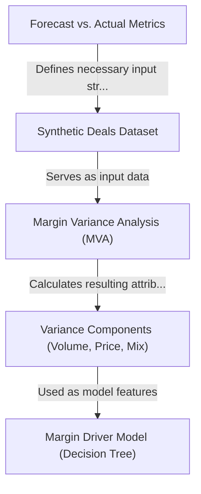
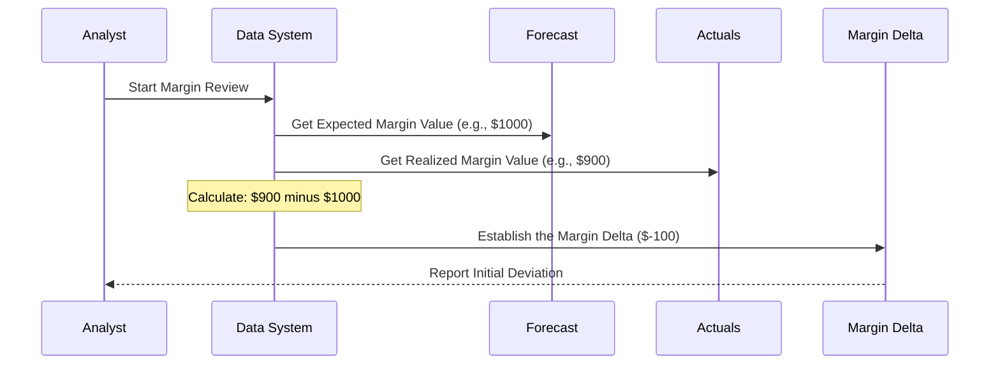
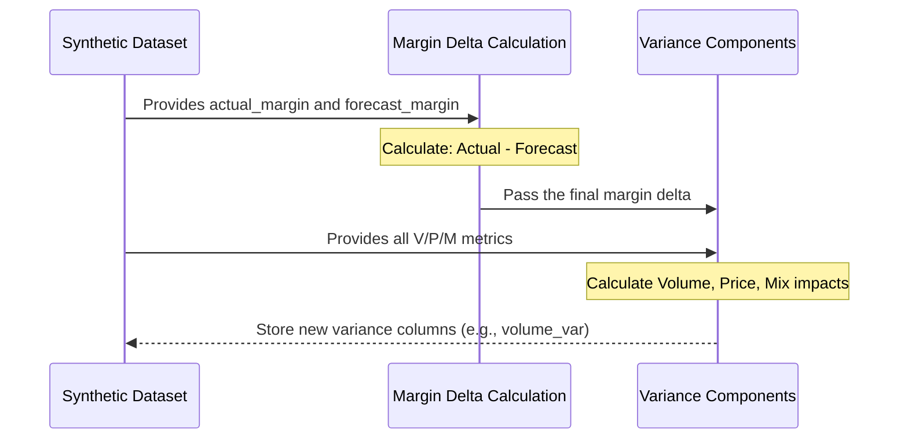
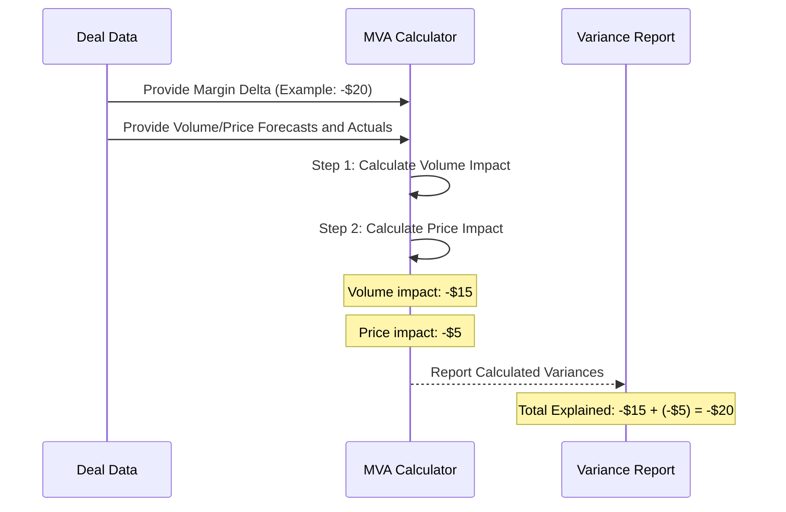
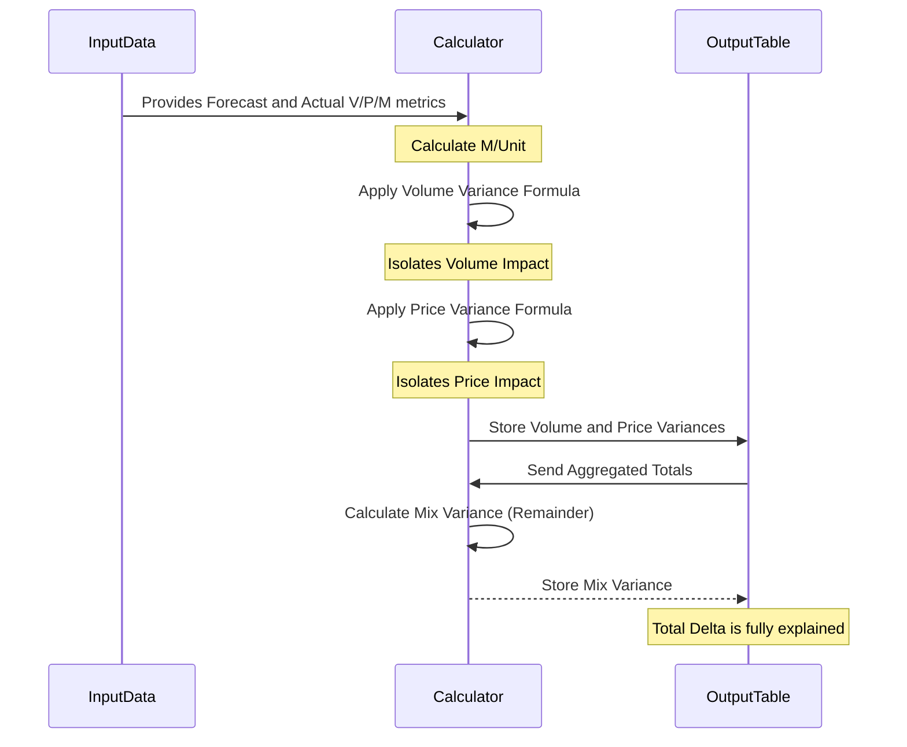
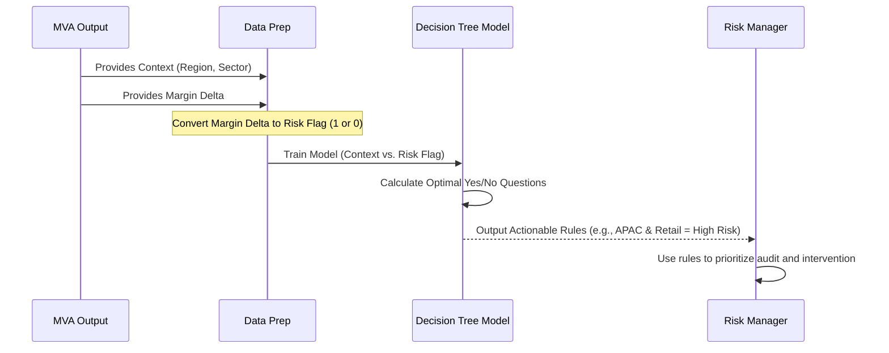

# Tutorial: Synthetic-Deal-Analytics-Margin-Variance-Modelling

This project uses a *Synthetic Deals Dataset* to simulate commercial performance and figure out **why** actual profit margins differed from the expected forecast. It achieves this using **Margin Variance Analysis** (MVA) to systematically break down the total margin difference into specific financial impacts like changes in volume or price. Finally, a *Decision Tree Model* is employed to automatically identify underlying systematic factors (like Region or Sector) linked to common margin losses, turning raw data into actionable business intelligence.


## Visual Overview



## Chapters

1. [Forecast vs. Actual Metrics
](01_forecast_vs__actual_metrics_.md)
2. [Synthetic Deals Dataset
](02_synthetic_deals_dataset_.md)
3. [Margin Variance Analysis (MVA)
](03_margin_variance_analysis__mva__.md)
4. [Variance Components (Volume, Price, Mix)
](04_variance_components__volume__price__mix__.md)
5. [Margin Driver Model (Decision Tree)
](05_margin_driver_model__decision_tree__.md)


# Chapter 1: Forecast vs. Actual Metrics

Welcome to the `Synthetic-Deal-Analytics` project! We are starting at the very foundation of financial analysis: understanding why things didn't go as planned.

Imagine you are running a business, and you expected to make $1,000 in profit from a major deal. When the numbers finally come in, you only made $900.

**Problem:** How do you explain that missing $100? Did you sell fewer items than expected? Did you have to lower the price?

If you only knew the $900 *Actual* profit, you wouldn't know if that was good or bad unless you remembered the $1,000 *Expected* profit. This comparison structure—**Forecast vs. Actual**—is the crucial starting point for all variance modeling.

## 1. What are Forecast and Actual Metrics?

In the world of commercial analytics, every important business measure comes in two forms:

### A. The Forecast (The Plan)

The Forecast is the expectation, the budget, or the plan set before the deal was executed. It represents what we *thought* would happen.

Think of the Forecast as the **recipe** you plan to follow.

### B. The Actual (The Reality)

The Actual is what truly happened. It is the realized performance once the deal or period is complete.

Think of the Actual as the **meal** that was actually served.

### Critical Metrics

In this project, we focus on three core metrics, each tracked as both a Forecast and an Actual value:

| Metric | Description | Example |
|---|---|---|
| **Volume** | How many units we expected/sold. | 100 units expected (Forecast) vs. 95 units sold (Actual). |
| **Price** | The price per unit we expected/achieved. | $10/unit expected (Forecast) vs. $9.50/unit achieved (Actual). |
| **Margin** | The profit we expected/realized from the deal. | $500 profit expected (Forecast) vs. $450 profit realized (Actual). |

## 2. Why Comparison is Necessary (The Delta)

The moment we pair the Forecast with the Actual, we can calculate the **Delta** (or Difference). This Delta is the size of the problem we need to solve.

The calculation is always:

$$\text{Delta} = \text{Actual} - \text{Forecast}$$

In our project, the main difference we track is the `margin_delta`.

If the result is positive, we beat the forecast (good!). If the result is negative, we missed the forecast (bad, and needs explaining).

### Example Calculation

Let's look at a single deal in our dataset:

| Metric | Forecast (Expected) | Actual (Realized) | Delta (Actual - Forecast) |
|---|---|---|---|
| Margin | $1,000 | $900 | **$-100** |

This **$-100$** `margin_delta` is the starting point for the entire project. The goal of the subsequent chapters is to figure out exactly *why* this $100 shortfall occurred.

## 3. How the Data is Structured

The raw data we generate for this project uses this dual-reporting structure clearly. Notice how the column names always reflect whether the metric is the expectation or the reality:

| Column Name | Type |
|---|---|
| `forecast_volume` | Expected volume |
| `actual_volume` | Realized volume |
| `forecast_margin` | Expected margin |
| `actual_margin` | Realized margin |
| `margin_delta` | The calculated difference |

In code, the calculation is straightforward:

```python
# Imagine this is data for one deal
expected_margin = 1000  # forecast_margin
realized_margin = 900   # actual_margin

# Calculate the difference (Delta)
margin_delta = realized_margin - expected_margin

print(f"Margin Delta: {margin_delta}")
# Output: Margin Delta: -100
```

This tiny calculation is the cornerstone of **Variance Analysis**.

## 4. The Process Flow

When we process the deal data, the core comparison step happens first. This sequence shows how the initial deviation is established:



Once the initial `margin_delta` (the deviation) is established, we can move on to the complex part: figuring out if the $100 loss was due to changes in [Volume, Price, or Mix](04_variance_components__volume__price__mix__.md).

---

## Conclusion

This chapter introduced the fundamental comparison structure required for variance analysis: every important metric must be tracked as both a **Forecast** (the plan) and an **Actual** (the reality). The difference between these two, the **Delta**, gives us the size of the problem we need to explain.

In the next chapter, we will dive into the specific synthetic dataset we created for this project and see how these dual metrics are stored and used to analyze commercial deals.

Ready to see the data?

[Next Chapter: Synthetic Deals Dataset](02_synthetic_deals_dataset_.md)


# Chapter 2: Synthetic Deals Dataset

In [Chapter 1: Forecast vs. Actual Metrics](01_forecast_vs__actual_metrics_.md), we learned that the first step in analysis is calculating the crucial difference (the Delta) between what we planned (Forecast) and what actually happened (Actual).

Now, we need the actual data to work with!

### Why We Use Fake Data (Synthetic)

In the real world, company financial data is highly sensitive, proprietary, and private. We cannot share actual sales receipts or margin reports publicly.

To teach robust analytical methods—like [Margin Variance Analysis (MVA)](03_margin_variance_analysis__mva__.md)—we need a safe, clean, and controlled practice environment. That's where the **Synthetic Deals Dataset** comes in.

This project is built around the idea of a **practice sandbox**. We generated data that *looks* exactly like real business transactions but contains no actual company secrets. The data is structured specifically to challenge our analytical methods and ensure we can properly track differences between expected and realized performance.

## 1. What is a Synthetic Deal?

In this dataset, every single row is a **Synthetic Deal**.

Imagine a complex, detailed sales receipt or a signed commercial agreement between a company and a client. That document defines the terms (expected price, expected volume). After the sale is complete, we get the real numbers (actual price, actual volume).

A synthetic deal simulates this entire transaction. It captures all the required information in one row:

1.  **The Plan (Forecast):** What the company expected to earn.
2.  **The Reality (Actual):** What the company actually earned.
3.  **The Context:** Where the deal happened (Region) and what kind of business it was (Sector).

## 2. Structure of the Dataset

Our Synthetic Deals Dataset is essentially a large spreadsheet (a table) containing thousands of these simulated transactions.

The structure is vital because it links the dual metrics (Forecast vs. Actual) with the business context:

| Column Category | Example Columns | Purpose |
|---|---|---|
| **Context/Identifiers** | `region`, `sector` | Tells us *where* and *what kind* of business it was. |
| **Volume Metrics** | `forecast_volume`, `actual_volume` | Tracks the difference in units sold. |
| **Price Metrics** | `forecast_price`, `actual_price` | Tracks the difference in unit price achieved. |
| **Margin Metrics** | `forecast_margin`, `actual_margin` | Tracks the crucial difference in profit. |

This dataset forms the essential input for all subsequent analysis steps. We use these columns to calculate the core variances.

## 3. Viewing the Deals in Practice

When we load this data into a program (like Python), we see this structure clearly. We use standard data tools (like the Pandas library) to read and manage this table data.

```python
import pandas as pd

# 1. Load the generated synthetic data from a file
df = pd.read_csv('synthetic_deals.csv')

# 2. Look at key columns for the first few deals
print(df[['region', 'forecast_margin', 'actual_margin']].head())
```

| region | forecast\_margin | actual\_margin |
|---|---|---|
| Americas | 8000.0 | 7800.0 |
| EMEA | 12000.0 | 12500.0 |
| APAC | 5000.0 | 4950.0 |
| Americas | 15000.0 | 14900.0 |
| EMEA | 7000.0 | 7100.0 |

**Interpreting the Output:**

*   **Deal 1 (Row 0):** This deal in the *Americas* expected to earn a margin of $8,000 but only realized $7,800. The goal of our project is to figure out if that $-\$200$ difference was caused by a change in Volume, Price, or both.
*   **Deal 2 (Row 1):** This deal in *EMEA* expected $12,000 but realized $12,500. This positive delta must also be explained!

## 4. The Data Flow

The entire project revolves around starting with this input data and calculating new columns that explain the margin delta.



By ensuring the dataset contains both the Forecast and Actual values for every variable, we create the perfect environment to apply the mathematical rules of [Margin Variance Analysis (MVA)](03_margin_variance_analysis__mva__.md).

---

## Conclusion

The **Synthetic Deals Dataset** provides the realistic, structured input required for complex financial modeling. By designing this data to contain both Forecast and Actual metrics side-by-side for thousands of transactions, we have established the necessary environment—the sandbox—to test our analysis tools.

We now have the problem (the Margin Delta) and the dataset that contains all the ingredients (Volume, Price, Margin, Region, Sector). Next, we will introduce the primary method we use to break down that problem: Margin Variance Analysis.

[Next Chapter: Margin Variance Analysis (MVA)](03_margin_variance_analysis__mva__.md)


# Chapter 3: Margin Variance Analysis (MVA)

We have successfully established the foundational elements of our analysis. In [Chapter 1: Forecast vs. Actual Metrics](01_forecast_vs__actual_metrics_.md), we learned how to calculate the **Margin Delta** (the difference between what we planned and what we earned). In [Chapter 2: Synthetic Deals Dataset](02_synthetic_deals_dataset_.md), we found the data we will use to measure this difference.

Now, we move to the core analytical technique of this project: **Margin Variance Analysis (MVA)**.

---

## 1. What is Margin Variance Analysis (MVA)?

Imagine you set a goal to walk 10 miles today but only walked 8. You have a gap of 2 miles. That 2-mile gap is your **Delta**.

MVA is the process of figuring out *why* you only walked 8 miles. Was it because you started late (Time)? Did you take a longer, less direct route (Efficiency)? Did you simply stop early (Volume)?

In commercial analysis, MVA is the central technique used to explain **why the actual profit margin differs from the expected (forecast) margin.**

MVA transforms a single, scary number (the total loss) into a structured, actionable explanation.

| Instead of Reporting... | MVA Tells Us... |
|---|---|
| **"We missed the target by $200."** | **"We missed the target by $200 because..."** |
| | **$120** was lost because we sold fewer units (Volume). |
| | **$80** was lost because we had to lower the price (Price). |

### The Goal: Structured Accountability

Commercial teams cannot improve performance if they only know *that* they failed. They need to know *how* and *where* they failed. MVA provides this structure, ensuring every dollar of margin deviation is traced back to a specific financial lever (like Volume or Price).

## 2. The Input and Output of MVA

To perform MVA, we need the dual metrics we discussed in Chapter 1: Forecast and Actual for Volume, Price, and Margin.

### A. Input Data (From the Synthetic Dataset)

MVA requires the foundational metrics stored in our synthetic deals data:

*   `actual_margin` and `forecast_margin` (to establish the total Delta)
*   `actual_volume` and `forecast_volume`
*   `actual_price` and `forecast_price`

### B. Output Data (The Explanation)

When we run the MVA process, we don't change the input data, but we *add* new, calculated columns that explain the delta.

The key output columns (which we will calculate mathematically in the next chapter) are the specific variance components:

| Variance Component | Meaning |
|---|---|
| `volume_var` | Dollar impact caused solely by selling more or fewer units. |
| `price_var` | Dollar impact caused solely by realizing a higher or lower unit price. |
| `mix_var` | Dollar impact caused by a shift in the overall portfolio of deals (e.g., selling more low-margin products). |

## 3. The Fundamental MVA Equation

The core idea of MVA is that the sum of the calculated variances must perfectly equal the total `margin_delta`.

If your total difference is $-\$1,000$, and MVA is calculated correctly, then:

$$\text{Margin Delta} = \text{Volume Variance} + \text{Price Variance} + \text{Mix Variance}$$

If the numbers don't add up, the MVA calculation is wrong!

This equation is the audit trail that ensures MVA provides a complete explanation for the profit change.

## 4. How MVA Works (Conceptual Flow)

The Margin Variance Analysis process is a mathematical rearrangement of existing data. It takes the total difference and uses formulas to attribute that difference to its root causes.

Imagine we are looking at a single deal with a total margin loss of $20.



The MVA Calculator is essentially a set of simple mathematical rules (multiplication and subtraction) that systematically isolate the financial effect of *just* the volume change, and *just* the price change.

## 5. MVA in Practice (Adding the Explanation Columns)

In our project, applying MVA means taking the raw data (like the input below) and calculating the new explanation columns.

### Before MVA (The Mystery)

| Deal ID | forecast\_margin | actual\_margin | margin\_delta |
|---|---|---|---|
| A101 | $10,000 | $9,800 | **$-200** |

We know Deal A101 missed the target by $200, but we don't know why.

### After MVA (The Solution)

When we run the MVA formulas (which we will detail in the next chapter), we populate the variance columns:

```python
# Imagine we run the MVA function on Deal A101
# It uses the input V/P/M metrics to calculate the drivers.

margin_delta = -200

# The MVA calculation yields these results:
deal_A101_volume_var = -150.0  # Loss due to lower volume
deal_A101_price_var = -50.0   # Loss due to lower price
deal_A101_mix_var = 0.0       # No mix effect on this single deal

# Check the total: -150.0 + (-50.0) + 0.0 = -200.0 (Matches the delta!)

# We now store these as new columns in our dataset.
```

The resulting enriched data table now looks like this:

| Deal ID | margin\_delta | **volume\_var** | **price\_var** | **mix\_var** |
|---|---|---|---|---|
| A101 | $-200$ | **$-150$** | **$-50$** | **$0$** |

This structure is immensely powerful. If the commercial team managing Deal A101 asks why they missed the target, the answer is precise: "You hit your expected price, but the actual volume delivered was too low, costing $150 in lost margin."

---

## Conclusion

Margin Variance Analysis (MVA) is the mechanism that takes the total gap between the plan and reality (the Margin Delta) and systematically breaks it down into clear, traceable components. By running MVA, we move from reporting *what* happened to explaining *why* it happened, assigning accountability to Volume, Price, and Mix changes.

We now understand the importance and structure of MVA. In the next chapter, we will open the black box and learn the exact mathematical formulas used to calculate these separate variance components (Volume, Price, and Mix).

[Next Chapter: Variance Components (Volume, Price, Mix)](04_variance_components__volume__price__mix__.md)

# Chapter 4: Variance Components (Volume, Price, Mix)

In [Chapter 3: Margin Variance Analysis (MVA)](03_margin_variance_analysis__mva__.md), we learned that MVA is the method used to explain the total difference (Delta) between the **Forecast** and the **Actual** margin.

But MVA doesn't just give us one answer; it breaks the problem into specific, quantifiable buckets. These buckets are the **Variance Components**: Volume, Price, and Mix.

This chapter is about understanding these three fundamental drivers and how they perfectly account for every dollar of margin change.

---

## 1. The Core Concept: Isolating the Impact

Imagine your business missed its margin target by $100. The commercial team needs to know: Was that $100 loss because they failed to sell enough units (Volume)? Or because they had to give bigger discounts (Price)?

The purpose of the Variance Components is to separate these effects mathematically. We want to calculate the specific dollar impact of *only* the volume change, assuming price stayed the same, and then the specific dollar impact of *only* the price change, assuming volume stayed the same.

The three primary Variance Components are:

| Component | What It Measures | Question It Answers |
|---|---|---|
| **Volume Variance** | Change in margin due to units sold (more or fewer). | Did we sell the right quantity? |
| **Price Variance** | Change in margin due to realized price per unit (higher or lower). | Did we charge the right price? |
| **Mix Variance** | Change in margin due to shifting portfolio composition (e.g., selling more low-profit items). | Did we sell the right *kind* of deals? |

The total of these three variances *must* equal the total `margin_delta`.

$$\text{Margin Delta} = \text{Volume Var} + \text{Price Var} + \text{Mix Var}$$

## 2. Deep Dive into the Components

Let's look at each component individually using simple math. For this example, we assume the margin per unit (M) is the difference between the selling price and the cost.

### A. Volume Variance

This measures the margin impact of selling more or fewer units than planned. It assumes the expected profit per unit was correct.

**The calculation:** We multiply the difference in units sold by the **expected margin per unit (Forecast Margin)**.

$$\text{Volume Var} = (\text{Actual Volume} - \text{Forecast Volume}) \times \text{Forecast Margin per Unit}$$

**Example:**

A deal expected to sell 100 units at a profit of $5 per unit. It only sold 90 units.

| Metric | Forecast | Actual |
|---|---|---|
| Volume | 100 units | 90 units |
| Margin/Unit | $5.00 | $5.00 |

```python
forecast_margin_per_unit = 5.00
actual_volume = 90
forecast_volume = 100

volume_change = actual_volume - forecast_volume  # -10 units
volume_variance = volume_change * forecast_margin_per_unit

print(f"Volume Variance: ${volume_variance}")
# Output: Volume Variance: $-50.0
```

**Result:** The business lost $50 purely because it sold 10 fewer units than planned.

### B. Price Variance

This measures the margin impact of achieving a different price (and thus a different margin per unit) than planned. It assumes the expected volume was correct.

**The calculation:** We multiply the change in margin per unit by the **actual volume sold**.

$$\text{Price Var} = (\text{Actual Margin per Unit} - \text{Forecast Margin per Unit}) \times \text{Actual Volume}$$

**Example:**

A deal expected to sell 100 units and make $5 profit per unit. It sold 100 units, but only made $4.50 profit per unit.

| Metric | Forecast | Actual |
|---|---|---|
| Volume | 100 units | 100 units |
| Margin/Unit | $5.00 | $4.50 |

```python
forecast_margin_per_unit = 5.00
actual_margin_per_unit = 4.50
actual_volume = 100

price_change_per_unit = actual_margin_per_unit - forecast_margin_per_unit # -$0.50
price_variance = price_change_per_unit * actual_volume

print(f"Price Variance: ${price_variance}")
# Output: Price Variance: $-50.0
```

**Result:** The business lost $50 purely because the realized profit per unit was $0.50 lower, applied across the 100 units sold.

---

### C. Mix Variance (The Portfolio Effect)

Volume and Price Variance explain what happened to the individual deal. **Mix Variance** explains the overall portfolio effect.

Imagine you have two products:

1.  **Product A:** High Margin ($10 profit)
2.  **Product B:** Low Margin ($2 profit)

You planned to sell 50% A and 50% B.
You actually sold 70% B and 30% A.

Even if your total *units* sold matched the forecast, the shift towards the lower-profit Product B (Product B is 'unfavorable mix') will decrease the total margin. This loss is the **Mix Variance**.

Mix Variance is often calculated as the unexplained remainder after calculating Volume and Price variances at an aggregated level (like region or sector). It captures the difference between the total margin change and what can be attributed solely to the total volume and average price changes.

**In the project, we calculate Mix Variance at the aggregated level (by Region or Sector) to see if the overall composition of deals shifted towards lower-margin categories.**

---

## 3. The Flow of Calculation in Code

Our Python script uses these exact formulas to enrich the [Synthetic Deals Dataset](02_synthetic_deals_dataset_.md).

First, we need to calculate the margin per unit for both forecast and actual:

```python
# 1. Calculate Margin per Unit
df['forecast_margin_per_unit'] = df['forecast_margin'] / df['forecast_volume']
df['actual_margin_per_unit'] = df['actual_margin'] / df['actual_volume']
```

Then, we calculate the variances for every single deal:

```python
# 2. Calculate Volume Variance for each deal
df['volume_var'] = (
    (df['actual_volume'] - df['forecast_volume']) * df['forecast_margin_per_unit']
)

# 3. Calculate Price Variance for each deal
df['price_var'] = (
    (df['actual_margin_per_unit'] - df['forecast_margin_per_unit']) * df['actual_volume']
)
```

### Isolating Mix Variance (Aggregation Step)

Since Mix Variance relates to the portfolio structure, we calculate the remaining unexplained delta at the grouping level (like by `region` or `sector`).

1. We sum up the total `margin_delta`, `volume_var`, and `price_var` for a group (e.g., the 'Americas' region).
2. The `mix_var` for that group is the remaining amount needed to close the gap.

```python
# Aggregate the calculated variances by Region
regional_summary = df.groupby('region').agg({
    'margin_delta': 'sum',
    'volume_var': 'sum',
    'price_var': 'sum'
}).reset_index()

# Calculate Mix Variance as the remainder
regional_summary['mix_var'] = (
    regional_summary['margin_delta'] - 
    regional_summary['volume_var'] - 
    regional_summary['price_var']
)
```

This ensures that for every region, the total margin deviation is perfectly explained by the sum of Volume, Price, and Mix.

## 4. The MVA Process Visualization

This diagram shows how MVA takes the input data (Forecast and Actual) and outputs the three isolated variance components:



The resulting `OutputTable` now contains the three crucial drivers that explain the margin change, setting the stage for deeper analysis in the next chapter.

---

## Conclusion

The Variance Components (Volume, Price, Mix) are the output of the Margin Variance Analysis (MVA) process. By applying specific mathematical formulas, we can perfectly isolate the dollar impact of changes in units sold (Volume), changes in price realization (Price), and changes in the overall deal composition (Mix).

This breakdown is essential because it allows commercial teams to move past guesswork and focus remediation efforts precisely where the losses occurred.

We now have all the calculated drivers explaining the margin deviation. In the next chapter, we will use a machine learning technique—the Decision Tree—to analyze these variances and discover which external factors, like region or sector, consistently drive positive or negative margin outcomes.

[Next Chapter: Margin Driver Model (Decision Tree)](05_margin_driver_model__decision_tree__.md)

# Chapter 5: Margin Driver Model (Decision Tree)

In the previous chapters, we accomplished the challenging task of explaining margin loss. We started with the total difference ([Margin Variance Analysis (MVA)](03_margin_variance_analysis__mva__.md)) and precisely calculated how much of that loss was due to changes in [Volume, Price, and Mix](04_variance_components__volume__price__mix__.md).

For example, we know a specific deal lost $200 because of poor pricing.

But that still leaves a critical question unanswered: **Is this a one-time issue, or is it a systematic risk tied to specific parts of the business?**

If every deal in the **APAC Region** within the **Retail Sector** consistently loses money, management needs to know this pattern so they can fix the underlying problem, not just the single deal.

This is the job of the **Margin Driver Model**, which uses a machine learning technique called a **Decision Tree** to automatically find these hidden, systematic patterns.

---

## 1. What is a Margin Driver Model?

The Margin Driver Model is the bridge that connects the *context* of the deal (like the Region and Sector) to the *financial outcome* (like a significant margin loss).

We use it to answer questions like:

> "Which combination of Region and Sector factors is most likely to result in a negative margin delta (risk)?"

### The Decision Tree Analogy: The Flow Chart

A Decision Tree is one of the simplest and most powerful machine learning models, especially for explainable financial analysis.

Imagine a complex game of "20 Questions." The Decision Tree uses a similar logic: it takes a massive amount of data and learns the best sequence of **Yes/No** questions to sort the outcomes.

*   **Question 1:** Is the deal in the Americas? (If yes, go left. If no, go right.)
*   **Question 2 (Left path):** Is the deal in the Finance sector? (If yes, it's usually a successful deal. If no, keep going.)

The output of the Decision Tree is a set of clear, actionable rules that define risk or success.

## 2. Preparing the Data for the Model

Decision Trees are typically used to predict categories, not continuous dollar amounts. Before we can train the model, we must convert our complex financial outcome (the `margin_delta`) into a simple, binary category: **Risk** or **No Risk**.

### Step A: Creating the Risk Flag

We define "Risk" as any deal where the `margin_delta` is negative (meaning we missed the forecast).

| margin\_delta (Input) | Risk Flag (Output) | Meaning |
|---|---|---|
| +$500 | 0 (No Risk/Success) | Actual Margin > Forecast Margin |
| -$150 | 1 (Risk/Failure) | Actual Margin < Forecast Margin |
| $0 | 0 (No Risk/Success) | Actual Margin = Forecast Margin |

In code, this is a simple comparison:

```python
import pandas as pd
# Assume df is our loaded synthetic dataset
# We create a new column called 'risk_flag'

# If margin_delta is negative (< 0), the result is True (1), otherwise False (0).
df['risk_flag'] = (df['margin_delta'] < 0).astype(int)

print(df[['margin_delta', 'risk_flag']].head())
```
| margin\_delta | risk\_flag |
|---|---|
| -200 | 1 |
| 500 | 0 |
| -50 | 1 |
| 10 | 0 |

The model will now try to predict the `risk_flag` (1 or 0) based on the Region and Sector of the deal.

## 3. Training the Decision Tree

We feed the model two types of data:

1.  **Features (The Context):** `region` and `sector` (the potential drivers).
2.  **Target (The Outcome):** `risk_flag` (what we are trying to predict).

We use the `scikit-learn` library in Python to quickly build and train the Decision Tree. (Note: Text columns like 'Americas' must first be converted into numerical format using techniques like one-hot encoding, as shown below.)

```python
from sklearn.tree import DecisionTreeClassifier

# 1. Select the Contextual Features (X)
X = df[['region', 'sector']] 
X_encoded = pd.get_dummies(X, drop_first=True) # Convert text to numbers (e.g., 'APAC' becomes a 1 or 0 column)

# 2. Select the Target Outcome (Y)
Y = df['risk_flag']

# 3. Initialize the model (max_depth=3 keeps the flow chart simple)
model = DecisionTreeClassifier(max_depth=3)

# 4. Train the model to find patterns
model.fit(X_encoded, Y)

# The model is now "trained" and holds the systematic rules!
```

After training, the Decision Tree has mathematically determined which splits in the data best separate the 'Risk' deals (1) from the 'No Risk' deals (0).

## 4. Interpreting the Tree Structure

The real power of the Decision Tree is its **explainability**. We can visualize the logic it learned.

The tree finds the single question that explains the most variance first.

### Example Decision Tree Logic

Imagine the model learned this structure:

```mermaid
graph TD
    A[Root: All Deals - 50% Risk] -->|Region = APAC?| B{Yes (75% Risk)}
    B -->|Sector = Retail?| C[Node 1: APAC & Retail - 90% Risk]
    B -->|Sector != Retail| D[Node 2: APAC & Other - 60% Risk]
    A -->|Region != APAC| E{No (30% Risk)}
    E -->|Sector = Finance?| F[Node 3: Non-APAC & Finance - 10% Risk]
    E -->|Sector != Finance| G[Node 4: Non-APAC & Other - 45% Risk]
```

### Actionable Insights from the Tree

By looking at the nodes, we transform raw variance data into clear insights:

1.  **Systematic Risk:** Deals in **Node 1 (APAC & Retail)** have a **90%** chance of missing the margin forecast. This is the highest risk area.
2.  **Mitigation Opportunity:** Deals in **Node 3 (Non-APAC & Finance)** are highly successful, with only a **10%** chance of risk. This cluster is working well and might contain best practices.

The Decision Tree has isolated the specific combinations of operational factors (`region`, `sector`) that consistently drive margin outcomes. This allows risk managers to prioritize their attention on the specific segments identified as "Node 1."

## 5. The Full Process Flow

This sequence summarizes how the Margin Driver Model uses the analysis from the previous chapters to generate actionable insights:



By completing this process, we move beyond simply knowing that we lost money, and we now understand the systemic operational factors driving that loss. This is the ultimate goal of the `Synthetic-Deal-Analytics` project: transforming raw data into predictive, explainable insights.

---

## Conclusion

The **Margin Driver Model** uses a Decision Tree to automatically learn systematic patterns linking operational context (like Region and Sector) to margin outcomes (Risk Flag). This process transforms the detailed variance explanations (Volume, Price, Mix) into high-level, actionable risk maps for management. Instead of reviewing individual failures, teams can now target systematic weaknesses identified by the model, achieving better control over commercial performance.

This chapter concludes our primary analytical workflow. We started with raw forecast data and finished with a structured, explainable machine learning model that predicts risk based on business factors.

